# Web Game Deeper Dive
This is an extended look at the Web Game project and a culmulative description of its concepts and functionality.

## Progression
This project was presented across four parts.
<details>
<summary>Part 1 - Positioning Images and Adding a Mouse Click Event</summary>
### Version 1
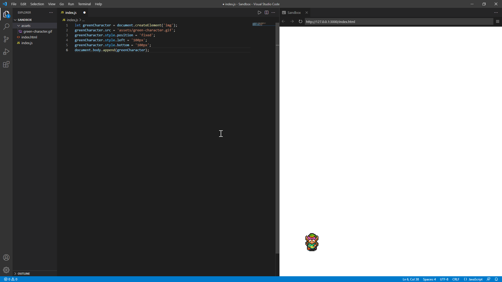

For this version, I simply started by importing the =green= 
```javascript
let greenCharacter = document.createElement('img');
greenCharacter.src = 'assets/green-character.gif';
greenCharacter.style.position = 'fixed';
greenCharacter.style.left = '100px';
greenCharacter.style.bottom = '100px';
document.body.append(greenCharacter);
```

This code creates an HTML element object - in this case, an ```img``` tag.

The ```src``` property of the element is set to the relative file path of the image (gif format in this instance, but png will be shown later).<sup>[1](#footnote001)</sup>

### Version 2

Now, adding a pine tree using the same code structure:
```javascript
let pineTree = document.createElement('img');
pineTree.src = 'assets/pine-tree.png';
pineTree.style.position = 'fixed';
pineTree.style.left = '450px';
pineTree.style.bottom = '200px';
document.body.append(pineTree);
```
However, what about adding more images later? This is redundancy a function can help solve.

### Version 3 - Refactoring Using a Function
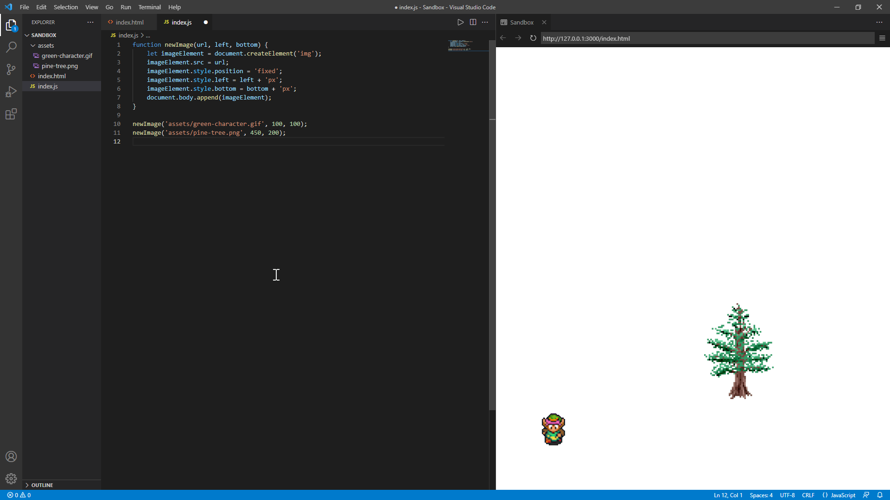
The code becomes more sophisticated and refined by eliminating redundancy where possible. In this case, the function eliminates redundant code structure.
```javascript
function newImage(url, left, bottom) {
    let imageElement = document.createElement('img');
    imageElement.src = url;
    imageElement.style.position = 'fixed';
    imageElement.style.left = left + 'px';
    imageElement.style.bottom = bottom + 'px';
    document.body.append(imageElement);
}

newImage('assets/green-character.gif', 100, 100);
newImage('assets/pine-tree.png', 450, 200);
```
### Version 4 - Adding More Images

And now with more images placed on the page with the same function as before, ```newImage```.
```javascript
newImage('assets/tree.png', 200, 300);
newImage('assets/pillar.png', 350, 100);
newImage('assets/crate.png', 150, 200);
newImage('assets/well.png', 500, 425);
```
### Version 5 - Add an Item (Not an Image)
Adding a sword for the player to click to pick up.

This is a variation on the ```newImage()``` function, where an event listener is added and on the ```click``` event, the item disappears from the document body.

I begin by adding the return to the ```newImage()``` function.

```javascript
function newImage(url, left, bottom) {
    let imageElement = document.createElement('img');
    imageElement.src = url;
    imageElement.style.position = 'fixed';
    imageElement.style.left = left + 'px';
    imageElement.style.bottom = bottom + 'px';
    document.body.append(imageElement);

    return imageElement;
}
```

```javascript
function newItem(url, left, bottom) {
    newImage(url, left, bottom);
}

newItem('assets/sword.png', 500, 405);
```

And now, the sword appears.  However, nothing happens when it is clicked.  It should disappear.


To remedy this, make two changes to the ```newItem()``` function:  declare a variable to hold the object (image element item) returned from the ```newImage``` function call, and the second, add the event listener as shown.

```javascript
function newItem(url, left, bottom) {
    let itemImageElement = newImage(url, left, bottom);
    itemImageElement.addEventListener('click', function() {
        itemImageElement.remove();
    });
}
```
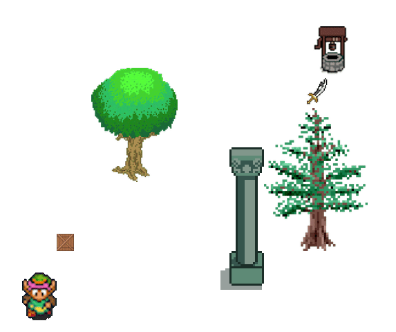

The animated GIF doesn't show the mouse movement too well, but rest assured, the mouse was positioned over the sword item before the left mouse button was clicked to remove the item image element from the document body.

### Version 6 - Add More Items with the Function
Adding two more items to the document with the ```newItem()``` function from before.
```javascript
newItem('assets/shield.png', 165, 185);
newItem('assets/staff.png', 600, 100);
```
The results are shown below (again, the mouse pointer isn't captured precisely located in this animated GIF).

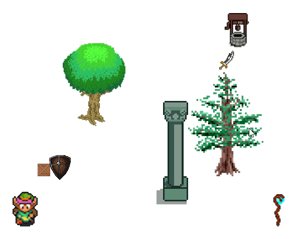

### Version 7 - Modifying the Event Behavoir
What if we wanted to make a change across all items?  With a function it's very easy - just one change, instead of changing each time the ```newItem``` block appeared in the code.
</details>

## Finished Result - Part 1
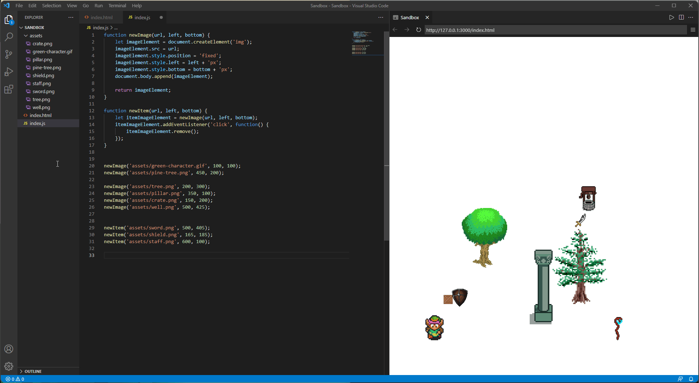
## Items of Interest in Part 1
Part 1 utilized the following JavaScript items:

```javascript
document.createElement()
document.createElement().style.position
document.createElement().style.left
document.createElement().style.bottom

document.body.append()

function name() {
    // function body goes here
    return // in our example, we returned a DOM object
}

document.createElement().addEventListener('click', () => {
    // when a mouse pointer is clicked on the element created, the function in this declaration is performed.
})

document.body.append(document.createElement())

document.createElement().remove()
```


---


<details><summary>Part 2</summary></details>
<details><summary>Part 3</summary></details>
<details><summary>Part 4</summary></details>


## Footnotes
<a name="footnote001">1</a>: The image tag supports other file formats, for example ```*.jpg``` among others.

<a name="footnote002">2</a>: The assignment does not explain this, and my explanation may be incorrect, but here it goes.  GIF images do not have the possibility of being created with transparent backgrounds, but they do have the ability to be animated.  PNG images are the opposite - "yes" to background transparency for a PNG and "no" to an animated image in a PNG.

## Additional Information
<details><summary>Screen Captures of Original Assignment Instructions - Part 1</summary>
    <h2>Original Assignment - Part 1</h2>


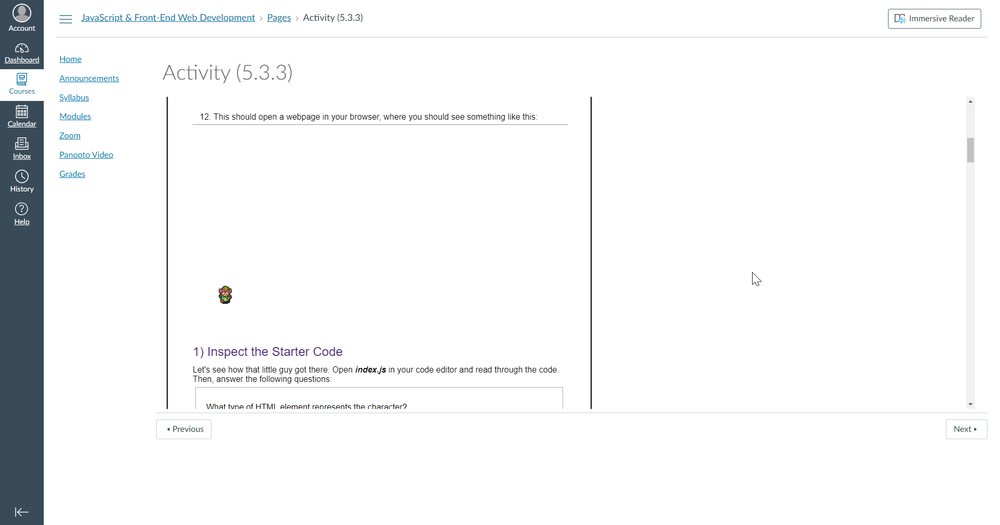
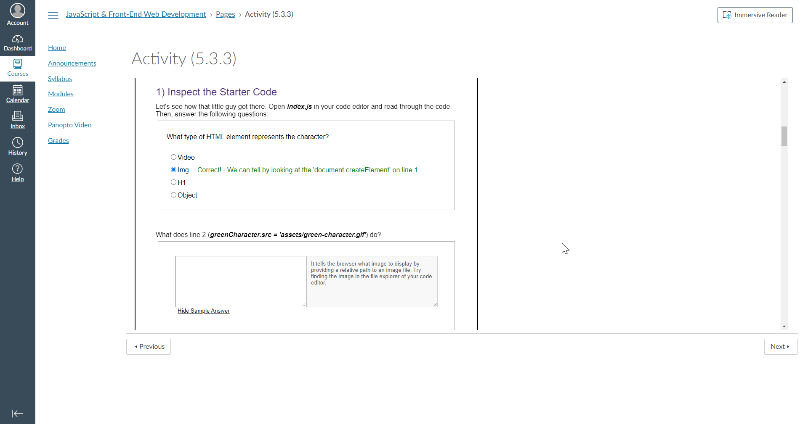
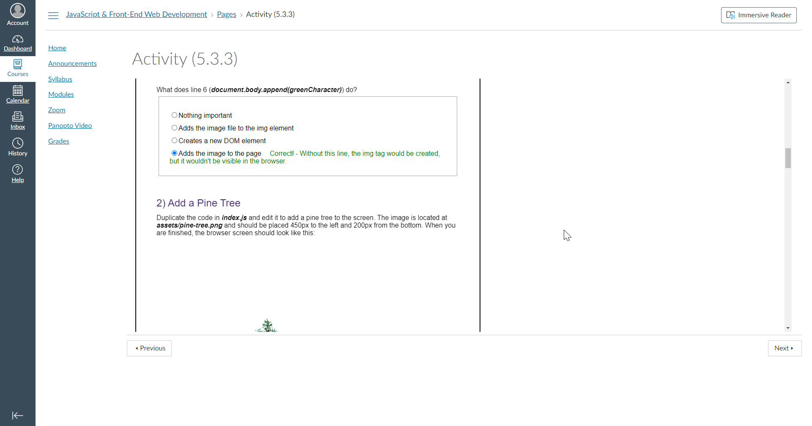
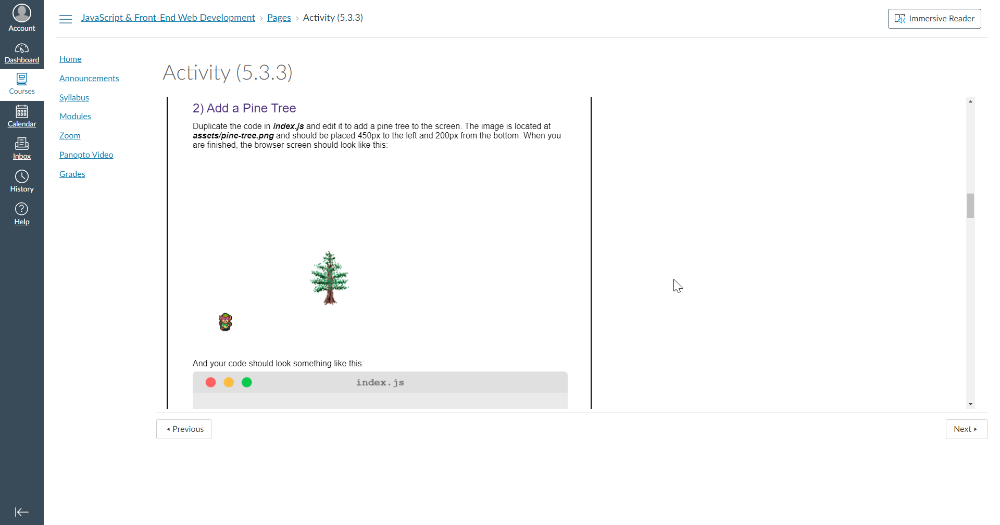


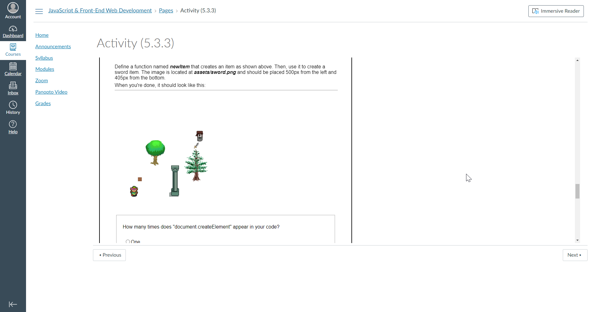

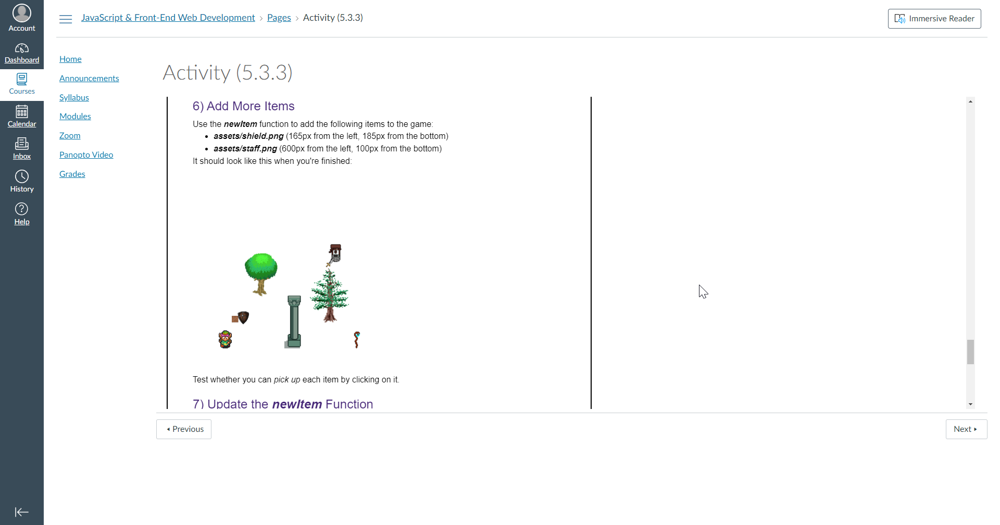
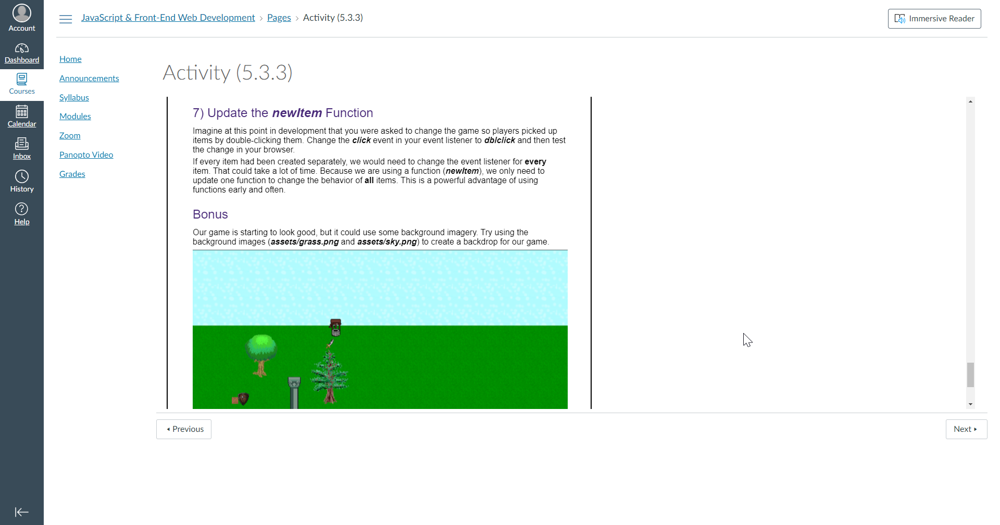
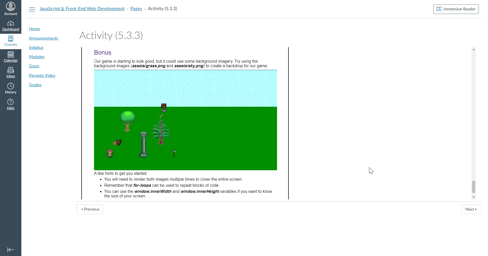
</details>

