# Web Game Deeper Dive
This is an extended look at the Web Game project and a culmulative description of its concepts and functionality.

## Progression
This project was presented across four parts.
### Part 1 - Positioning Images and Adding a Mouse Click Event
#### Version 1


For this version, I simply started by importing the =green= 
```javascript
let greenCharacter = document.createElement('img');
greenCharacter.src = 'assets/green-character.gif';
greenCharacter.style.position = 'fixed';
greenCharacter.style.left = '100px';
greenCharacter.style.bottom = '100px';
document.body.append(greenCharacter);
```

This code creates an HTML element object - in this case, an ```img``` tag.

The ```src``` property of the element is set to the relative file path of the image (gif format in this instance, but png will be shown later).<sup>[1](#footnote001)</sup>

#### Version 2

Now, adding a pine tree using the same code structure:
```javascript
let pineTree = document.createElement('img');
pineTree.src = 'assets/pine-tree.png';
pineTree.style.position = 'fixed';
pineTree.style.left = '450px';
pineTree.style.bottom = '200px';
document.body.append(pineTree);
```
However, what about adding more images later? This is redundancy a function can help solve.

#### Version 3 - Refactoring Using a Function

The code becomes more sophisticated and refined by eliminating redundancy where possible. In this case, the function eliminates redundant code structure.
```javascript
function newImage(url, left, bottom) {
    let imageElement = document.createElement('img');
    imageElement.src = url;
    imageElement.style.position = 'fixed';
    imageElement.style.left = left + 'px';
    imageElement.style.bottom = bottom + 'px';
    document.body.append(imageElement);
}

newImage('assets/green-character.gif', 100, 100);
newImage('assets/pine-tree.png', 450, 200);
```
#### Version 4 - Adding More Images

And now with more images placed on the page with the same function as before, ```newImage```.
```javascript
newImage('assets/tree.png', 200, 300);
newImage('assets/pillar.png', 350, 100);
newImage('assets/crate.png', 150, 200);
newImage('assets/well.png', 500, 425);
```
#### Version 5 - Add an Item (Not an Image)
Adding a sword for the player to click to pick up.

This is a variation on the ```newImage()``` function, where an event listener is added and on the ```click``` event, the item disappears from the document body.

I begin by adding the return to the ```newImage()``` function.

```javascript
function newImage(url, left, bottom) {
    let imageElement = document.createElement('img');
    imageElement.src = url;
    imageElement.style.position = 'fixed';
    imageElement.style.left = left + 'px';
    imageElement.style.bottom = bottom + 'px';
    document.body.append(imageElement);

    return imageElement;
}
```

```javascript
function newItem(url, left, bottom) {
    newImage(url, left, bottom);
}

newItem('assets/sword.png', 500, 405);
```

And now, the sword appears.  However, nothing happens when it is clicked.  It should disappear.


To remedy this, make two changes to the ```newItem()``` function:  declare a variable to hold the object (image element item) returned from the ```newImage``` function call, and the second, add the event listener as shown.

```javascript
function newItem(url, left, bottom) {
    let itemImageElement = newImage(url, left, bottom);
    itemImageElement.addEventListener('click', function() {
        itemImageElement.remove();
    });
}
```


The animated GIF doesn't show the mouse movement too well, but rest assured, the mouse was positioned over the sword item before the left mouse button was clicked to remove the item image element from the document body.

#### Version 6 - Add More Items with the Function
Adding two more items to the document with the ```newItem()``` function from before.
```javascript
newItem('assets/shield.png', 165, 185);
newItem('assets/staff.png', 600, 100);
```
The results are shown below (again, the mouse pointer isn't captured precisely located in this animated GIF).


#### Version 7 - Modifying the Event Behavoir
What if we wanted to make a change across all items?  With a function it's very easy - just one change, instead of changing each time the ```newItem``` block appeared in the code.
</details>

## Finished Result - Part 1


And, here is the complete code listing:
```javascript
function newImage(url, left, bottom) {
    let imageElement = document.createElement('img');
    imageElement.src = url;
    imageElement.style.position = 'fixed';
    imageElement.style.left = left + 'px';
    imageElement.style.bottom = bottom + 'px';
    document.body.append(imageElement);

    return imageElement;
}

function newItem(url, left, bottom) {
    let itemImageElement = newImage(url, left, bottom);
    itemImageElement.addEventListener('click', function() {
        itemImageElement.remove();
    });
}


newImage('assets/green-character.gif', 100, 100);
newImage('assets/pine-tree.png', 450, 200);

newImage('assets/tree.png', 200, 300);
newImage('assets/pillar.png', 350, 100);
newImage('assets/crate.png', 150, 200);
newImage('assets/well.png', 500, 425);


newItem('assets/sword.png', 500, 405);
newItem('assets/shield.png', 500, 405);
newItem('assets/staff.png', 500, 405);
```
## Items of Interest in Part 1
Part 1 utilized the following JavaScript items:

```javascript
document.createElement()
document.createElement().style.position
document.createElement().style.left
document.createElement().style.bottom

document.body.append()

function name() {
    // function body goes here
    return // in our example, we returned a DOM object
}

document.createElement().addEventListener('click', () => {
    // when a mouse pointer is clicked on the element created, the function in this declaration is performed.
})

document.body.append(document.createElement())

document.createElement().remove()
```
---
### Part 2
The code resumes from where we were at in the previous part (Part 1).  Although, the image and item positions are located in slightly different places.  The only major change is the removal of our event listener in the ```newItem()``` function:
```javascript
function newItem(url, left, bottom) {
    let itemImageElement = newImage(url, left, bottom);
    // itemImageElement.addEventListener('click', function() {
    //     itemImageElement.remove();
    // });
}
```
#### Version 1
We start with a function that adds a ```div``` element to our document. This will be known as the "inventory."
```javascript
function newInventory() {
    let inventory = document.createElement('div')
    document.body.append(inventory)
}

newInventory();
```
Nothing is visible yet.  We add a border to the element, and see that it is positioned within the flow at the top of the document (it is not styled with ```position: 'fixed'```, so it is simply placed within the document flow like any other element).
```javascript
function newInventory() {
    let inventory = document.createElement('div')
    inventory.style.border = '2px solid black';

    document.body.append(inventory)
}

newInventory();
```
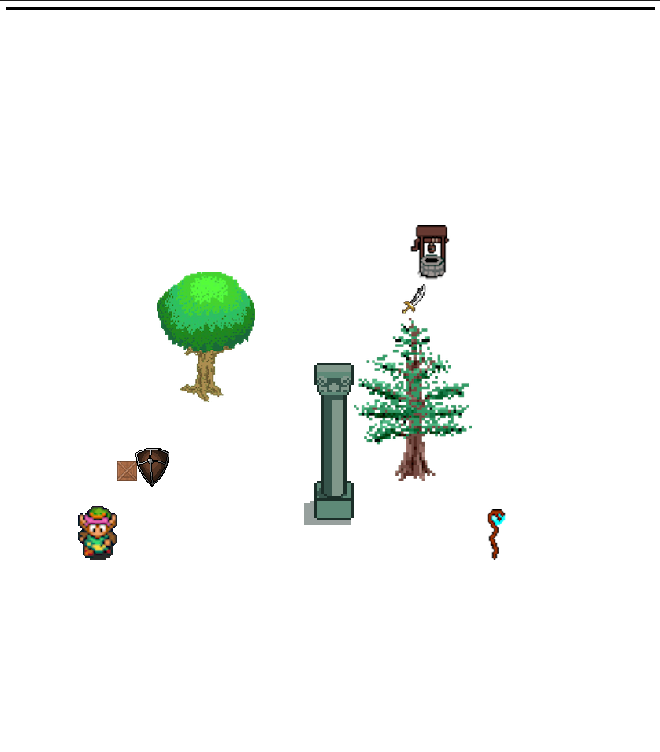

Adding width and height styles:
```javascript
function newInventory() {
    let inventory = document.createElement('div')
    inventory.style.border = '2px solid black';
    inventory.style.width = '100%';
    inventory.style.height = '100px';
    document.body.append(inventory)
}

newInventory();
```
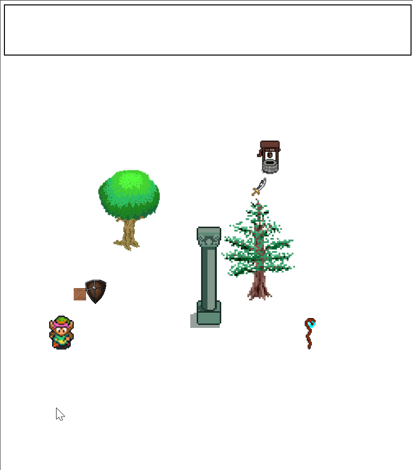

Changing the ```div``` color to brown:
```javascript
function newInventory() {
    let inventory = document.createElement('div')
    inventory.style.backgroundColor = 'brown';
    inventory.style.border = '2px solid black';
    inventory.style.width = '100%';
    inventory.style.height = '100px';
    document.body.append(inventory)
}

newInventory();
```

Now, positioning the ```div``` in a fixed position at the bottom, left of the screen:
```javascript
function newInventory() {
    let inventory = document.createElement('div')
    inventory.style.backgroundColor = 'brown';
    inventory.style.border = '2px solid black';
    inventory.style.width = '100%';
    inventory.style.height = '100px';
    inventory.style.position = 'fixed';
    inventory.style.bottom = '0px';
    inventory.style.left = '0px';
    document.body.append(inventory)
}

newInventory();
```

And finally, adding more style choices to position elements within the ```div``` to flexbox with a direction of "row," an element alignment of "center," and to justify the content with even spacing.
```javascript
function newInventory() {
    let inventory = document.createElement('div')
    inventory.style.backgroundColor = 'brown';
    inventory.style.border = '2px solid black';
    inventory.style.width = '100%';
    inventory.style.height = '100px';
    inventory.style.position = 'fixed';
    inventory.style.bottom = '0px';
    inventory.style.left = '0px';
    inventory.style.display = 'flex';
    inventory.style.flexDirection = 'row';
    inventory.style.alignItems = 'center';
    inventory.style.justifyContent = 'space-evenly';
    document.body.append(inventory)
}

newInventory();
```
That completes the setup.  We can now begin with the assignment instructions.
#### Version 2
When the user clicks on an item, we want to remove it from the document.  This is how:
```javascript
function newItem(url, left, bottom) {
    let itemImageElement = newImage(url, left, bottom);
    itemImageElement.addEventListener('click', () => {
        itemImageElement.remove();
    })
}
```
The function calls remain the same as before:
```javascript
newItem('assets/sword.png', 500, 555);
newItem('assets/shield.png', 165, 335);
newItem('assets/staff.png', 600, 250);
```

#### Version 3
The item is now removed when clicked.  Let's place the same item in the inventory ```div```.
```javascript
function newItem(url, left, bottom) {
    let itemImageElement = newImage(url, left, bottom);
    itemImageElement.addEventListener('click', () => {
        itemImageElement.remove();
        let inventoryItem = document.createElement('img');
        inventoryItem.src = url;
        inventory.append(inventoryItem);
    })
}
```
However, this will not work - the interpreter will throw an error. Our problem is that the ```inventory``` variable is not within scope. The user will click on items, and they will disappear (```.remove()```) but not reappear within the inventory ```div```.  The inventory declaration in ```newInventory()``` must be exposed at a level above the ```newInventory()``` function.  Let's make the variable declaration global:
```javascript
function newItem(url, left, bottom) {
    let itemImageElement = newImage(url, left, bottom);
    itemImageElement.addEventListener('click', () => {
        itemImageElement.remove();
        let inventoryItem = document.createElement('img');
        inventoryItem.src = url;
        inventory.append(inventoryItem);
    })
}

let inventory;

function newInventory() {
    inventory = document.createElement('div')
    inventory.style.backgroundColor = 'brown';
    inventory.style.border = '2px solid black';
    inventory.style.width = '100%';
    inventory.style.height = '100px';
    inventory.style.position = 'fixed';
    inventory.style.bottom = '0px';
    inventory.style.left = '0px';
    inventory.style.display = 'flex';
    inventory.style.flexDirection = 'row';
    inventory.style.alignItems = 'center';
    inventory.style.justifyContent = 'space-evenly';
    document.body.append(inventory)
}
```
Now, the application works as intended.
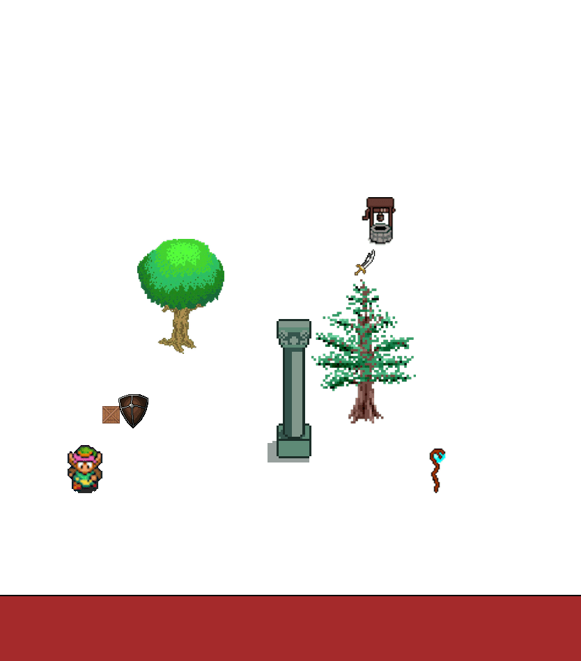
#### Version 4
To improve the coding, let's make the ```newInventory()``` function return a ```div``` element object.
```javascript
function newInventory() {
    let inventory = document.createElement('div')
    inventory.style.backgroundColor = 'brown';
    inventory.style.border = '2px solid black';
    inventory.style.width = '100%';
    inventory.style.height = '100px';
    inventory.style.position = 'fixed';
    inventory.style.bottom = '0px';
    inventory.style.left = '0px';
    inventory.style.display = 'flex';
    inventory.style.flexDirection = 'row';
    inventory.style.alignItems = 'center';
    inventory.style.justifyContent = 'space-evenly';
    document.body.append(inventory);
    return inventory;
}

let inventory = newInventory();
```
And now we have a more elegant function and function call to work with.
#### Version 5
Lastly, let's refactor to have the "clicked" items move into the inventory ```div``` through the use of a ```moveItemToInventory()``` function. Re-writing our ```newItem()``` function to incorporate this new item-moving function, we get the following:
```javascript
function moveItemToInventory(url) {
    let inventoryItem = document.createElement('img');
    inventoryItem.src = url;
    inventory.append(inventoryItem);
}

function newItem(url, left, bottom) {
    let itemImageElement = newImage(url, left, bottom);
    itemImageElement.addEventListener('click', () => {
        itemImageElement.remove();
        moveItemToInventory(url);
    })
}
```
The same item-clicking event removes the item from our document and places it in the inventory ```div```.  The functionality has not changed, although the implementation is better and more versatile.
## Finished Result - Part 2
```javascript
function newImage(url, left, bottom) {
    let imageElement = document.createElement('img');
    imageElement.src = url;
    imageElement.style.position = 'fixed';
    imageElement.style.left = left + 'px';
    imageElement.style.bottom = bottom + 'px';
    document.body.append(imageElement);

    return imageElement;
}

function moveItemToInventory(url) {
    let inventoryItem = document.createElement('img');
    inventoryItem.src = url;
    inventory.append(inventoryItem);
}

function newItem(url, left, bottom) {
    let itemImageElement = newImage(url, left, bottom);
    itemImageElement.addEventListener('click', () => {
        itemImageElement.remove();
        moveItemToInventory(url);
    })
}

function newInventory() {
    let inventory = document.createElement('div')
    inventory.style.backgroundColor = 'brown';
    inventory.style.border = '2px solid black';
    inventory.style.width = '100%';
    inventory.style.height = '100px';
    inventory.style.position = 'fixed';
    inventory.style.bottom = '0px';
    inventory.style.left = '0px';
    inventory.style.display = 'flex';
    inventory.style.flexDirection = 'row';
    inventory.style.alignItems = 'center';
    inventory.style.justifyContent = 'space-evenly';
    document.body.append(inventory);
    return inventory;
}

let inventory = newInventory();

newImage('assets/green-character.gif', 100, 250);
newImage('assets/tree.png', 200, 450);

newImage('assets/pillar.png', 350, 250);
newImage('assets/pine-tree.png', 450, 350);
newImage('assets/crate.png', 150, 350);
newImage('assets/well.png', 500, 575);


newItem('assets/sword.png', 500, 555);
newItem('assets/shield.png', 165, 335);
newItem('assets/staff.png', 600, 250);
```

---
### Part 3
We want our character to be able to move (or any other image or item in the future?).  Let's begin by defining a ```move()``` function.

#### Version 1
```javascript
function move(image, left, bottom) {
    image.style.position = 'fixed';
    image.style.left = left + 'px';
    image.style.bottom = bottom + 'px';
}
```
Then, to test this functionality change the ```newImage()``` code by replacing its positioning logic with a call to the ```move()``` function.
```javascript
function move(image, left, bottom) {
    image.style.position = 'fixed';
    image.style.left = left + 'px';
    image.style.bottom = bottom + 'px';
}

function newImage(url, left, bottom) {
    let imageElement = document.createElement('img');
    imageElement.src = url;
    move(imageElement, left, bottom);
    document.body.append(imageElement);

    return imageElement;
}
```
To test this functionality, modify the ```left``` and ```bottom``` parameters of the ```newImage('assets/green-character.gif', 100, 250);``` function call and watch as the green character moves around the screen.

#### Version 2 - Defining a Function Within Another Function
If we refactor the ```move()``` function to the following, we will have the same functionality.
```javascript
function move(image, left, bottom) {
    image.style.position = 'fixed';

    function moveToCoordinates(left, bottom) {
        image.style.left = left + 'px';
        image.style.bottom = bottom + 'px';

    }

    moveToCoordinates(left, bottom);
}
```
What if we make the ```moveToCoordinates()``` sub-function available to the caller of the ```move()``` function instead?

Changing the ```move()``` function and it's call in the ```newImage()``` function to the following produces the same results.  Note that the parameters for the ```move()``` function now exclude the ```left``` and ```bottom``` parameters, but those parameters are consumed in the sub-function, ```moveToCoordinates(left, bottom)```.

```javascript
function move(image) {
    image.style.position = 'fixed';

    function moveToCoordinates(left, bottom) {
        image.style.left = left + 'px';
        image.style.bottom = bottom + 'px';
    }

    return {
        to: moveToCoordinates
    }
}

function newImage(url, left, bottom) {
    let imageElement = document.createElement('img');
    imageElement.src = url;
    move(imageElement).to(left, bottom);
    document.body.append(imageElement);

    return imageElement;
}
```
#### Version 3
Note that event the ```newInventory()``` function can take advantage of this function.
```javascript
function newInventory() {
    let inventory = document.createElement('div')
    inventory.style.backgroundColor = 'brown';
    inventory.style.border = '2px solid black';
    inventory.style.width = '100%';
    inventory.style.height = '100px';
    move(inventory).to(0, 0);
    inventory.style.display = 'flex';
    inventory.style.flexDirection = 'row';
    inventory.style.alignItems = 'center';
    inventory.style.justifyContent = 'space-evenly';
    document.body.append(inventory);
    return inventory;
}

let inventory = newInventory();
```
To generalize the ```move()``` function from images to all element types, let's rename the ```image``` variable to ```element``` instead.  This will improve readability and understanding by others maintaining our code later.

```javascript
function move(element) {
    element.style.position = 'fixed';

    function moveToCoordinates(left, bottom) {
        element.style.left = left + 'px';
        element.style.bottom = bottom + 'px';
    }

    return {
        to: moveToCoordinates
    }
}
```
The finished code for this part looks like this:
```javascript
function move(element) {
    element.style.position = 'fixed';

    function moveToCoordinates(left, bottom) {
        element.style.left = left + 'px';
        element.style.bottom = bottom + 'px';
    }

    return {
        to: moveToCoordinates
    }
}

function newImage(url, left, bottom) {
    let imageElement = document.createElement('img');
    imageElement.src = url;
    move(imageElement).to(left, bottom);
    document.body.append(imageElement);

    return imageElement;
}

function moveItemToInventory(url) {
    let inventoryItem = document.createElement('img');
    inventoryItem.src = url;
    inventory.append(inventoryItem);
}

function newItem(url, left, bottom) {
    let itemImageElement = newImage(url, left, bottom);
    itemImageElement.addEventListener('click', () => {
        itemImageElement.remove();
        moveItemToInventory(url);
    })
}

function newInventory() {
    let inventory = document.createElement('div')
    inventory.style.backgroundColor = 'brown';
    inventory.style.border = '2px solid black';
    inventory.style.width = '100%';
    inventory.style.height = '100px';
    move(inventory).to(0, 0);
    inventory.style.display = 'flex';
    inventory.style.flexDirection = 'row';
    inventory.style.alignItems = 'center';
    inventory.style.justifyContent = 'space-evenly';
    document.body.append(inventory);
    return inventory;
}

let inventory = newInventory();

newImage('assets/green-character.gif', 100, 250);
newImage('assets/tree.png', 200, 450);

newImage('assets/pillar.png', 350, 250);
newImage('assets/pine-tree.png', 450, 350);
newImage('assets/crate.png', 150, 350);
newImage('assets/well.png', 500, 575);


newItem('assets/sword.png', 500, 555);
newItem('assets/shield.png', 165, 335);
newItem('assets/staff.png', 600, 250);
```
---
### Part 4
---


## Footnotes
<a name="footnote001">1</a>: The image tag supports other file formats, for example ```*.jpg``` among others.

<a name="footnote002">2</a>: The assignment does not explain this, and my explanation may be incorrect, but here it goes.  GIF images do not have the possibility of being created with transparent backgrounds, but they do have the ability to be animated.  PNG images are the opposite - "yes" to background transparency for a PNG and "no" to an animated image in a PNG.

## Additional Information
<details><summary>Screen Captures of Original Assignment Instructions - Part 1</summary>
    <h2>Original Assignment - Part 1</h2>


</details>
<details><summary>Screen Captures of Original Assignment Instructions - Part 2</summary>
    <h2>Original Assignment - Part 2</h2>
    
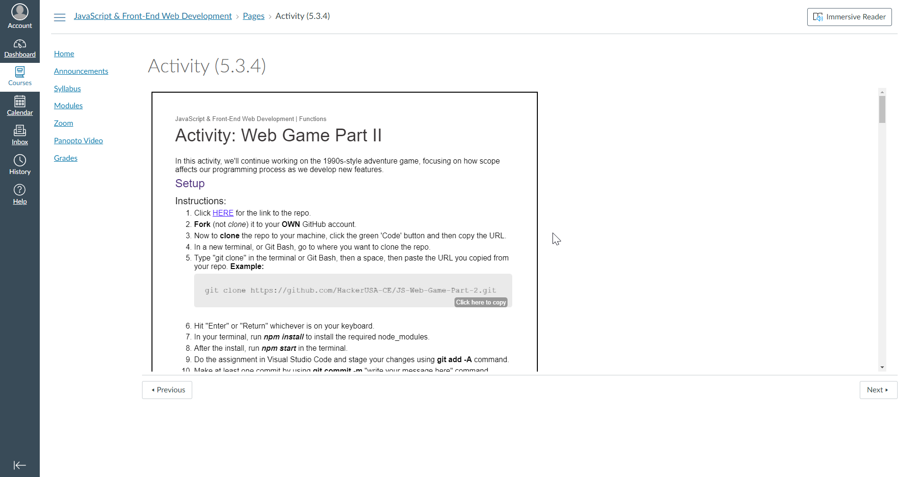
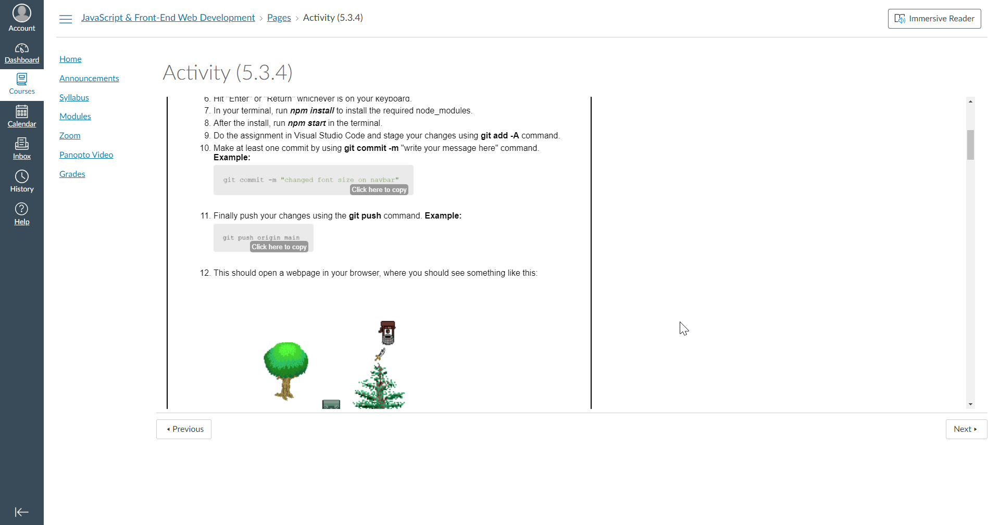


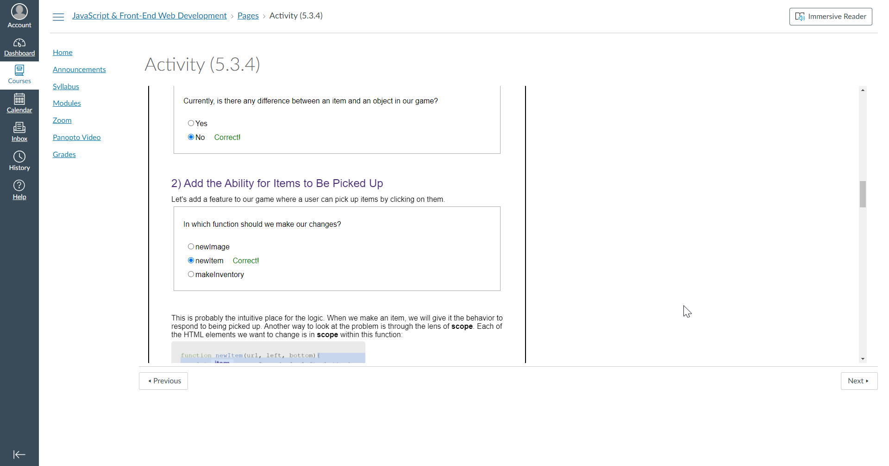


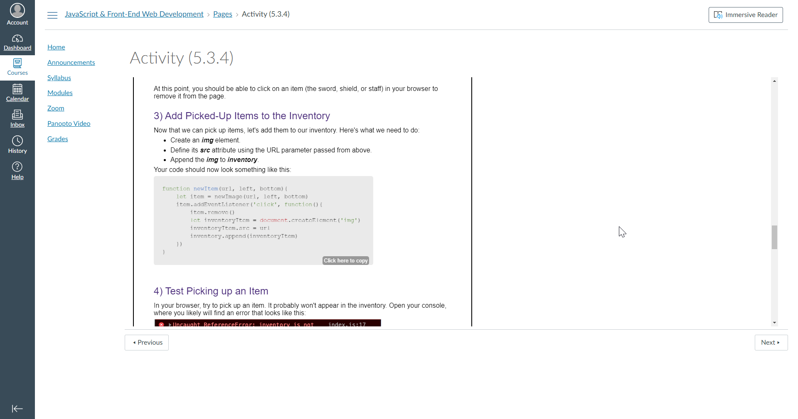


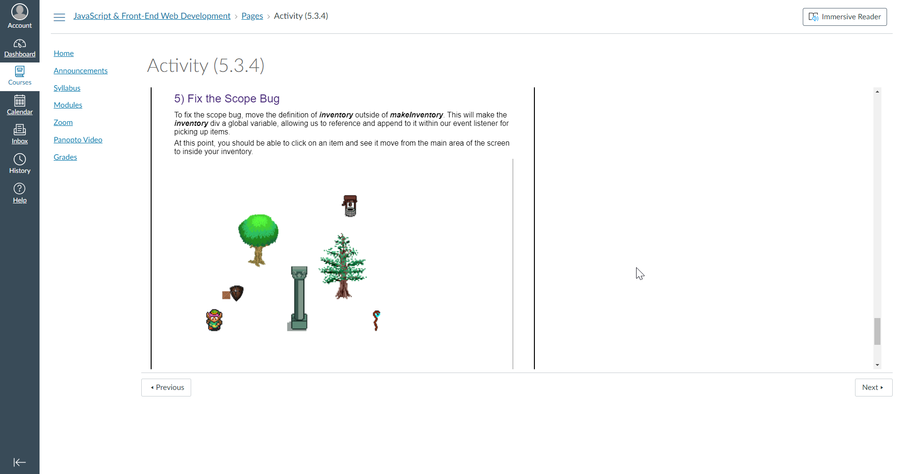

</details>
<details><summary>Screen Captures of Original Assignment Instructions - Part 3</summary>
    <h2>Original Assignment - Part 3</h2>
    
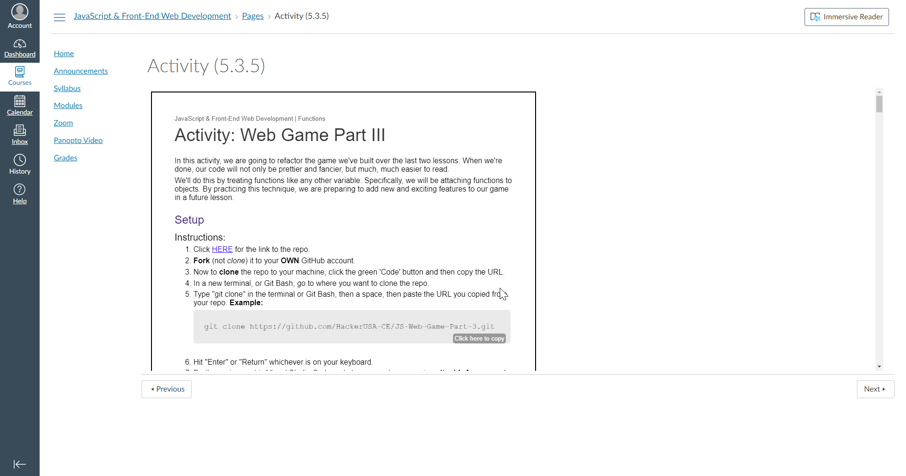

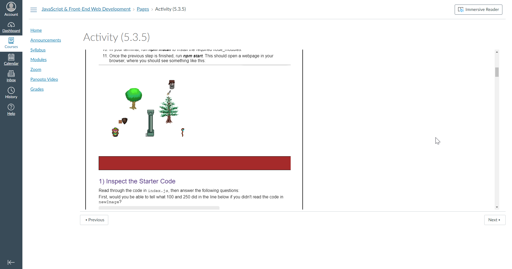


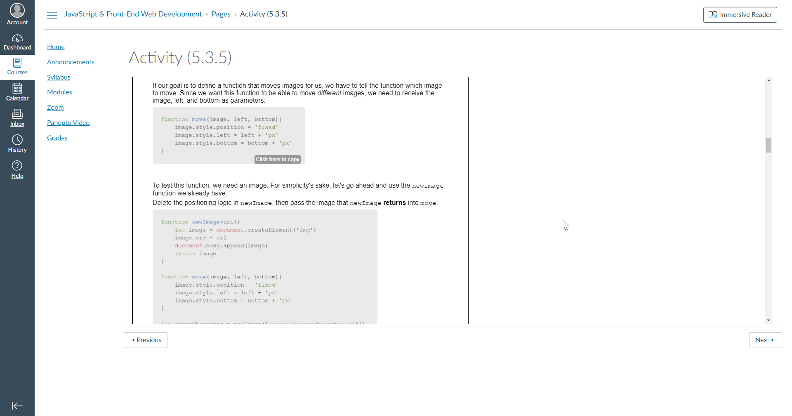
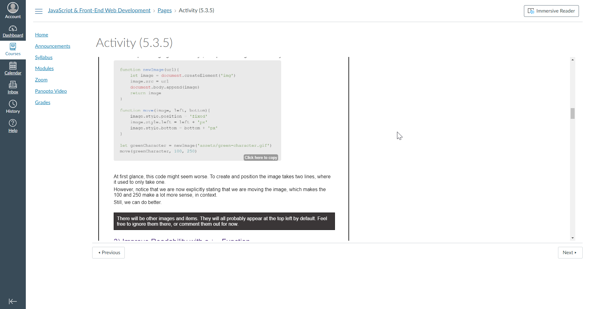
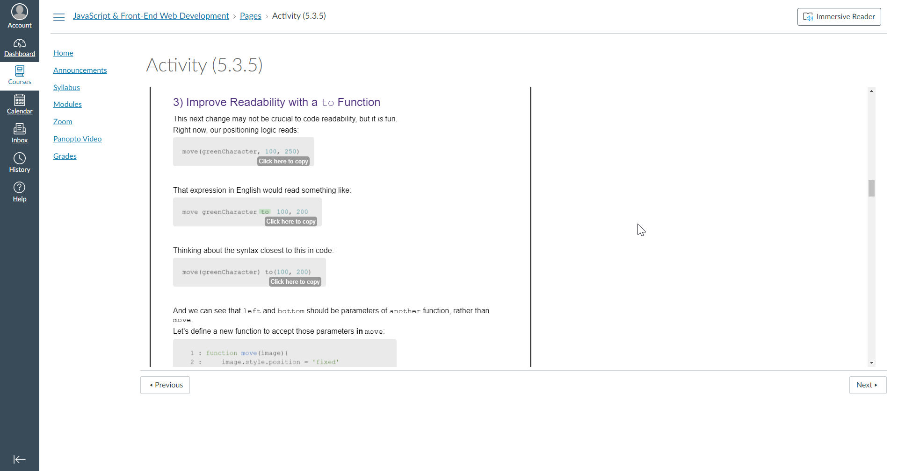

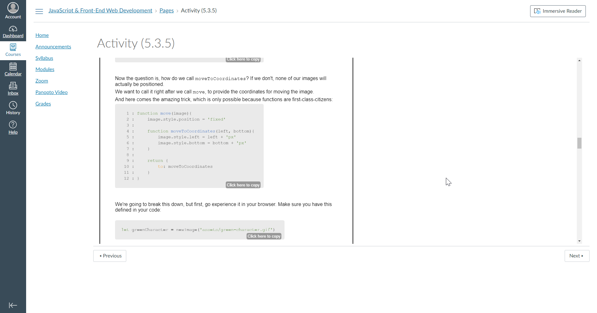
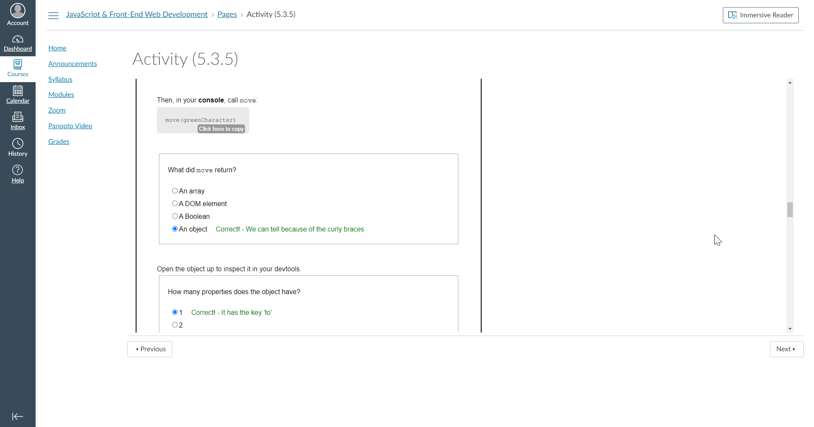


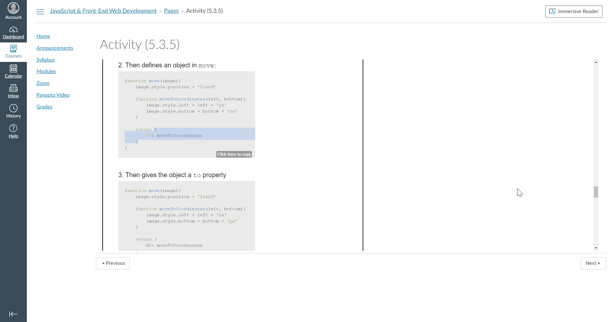
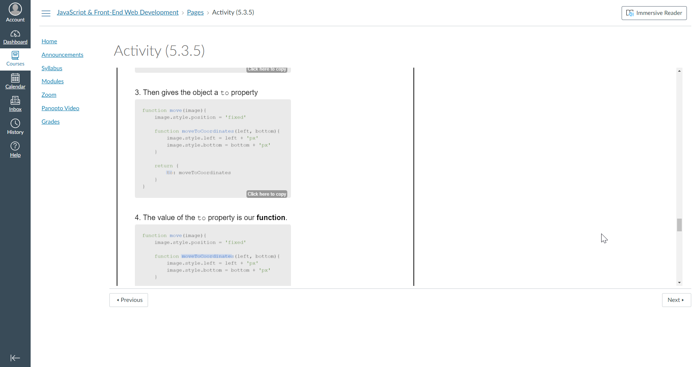


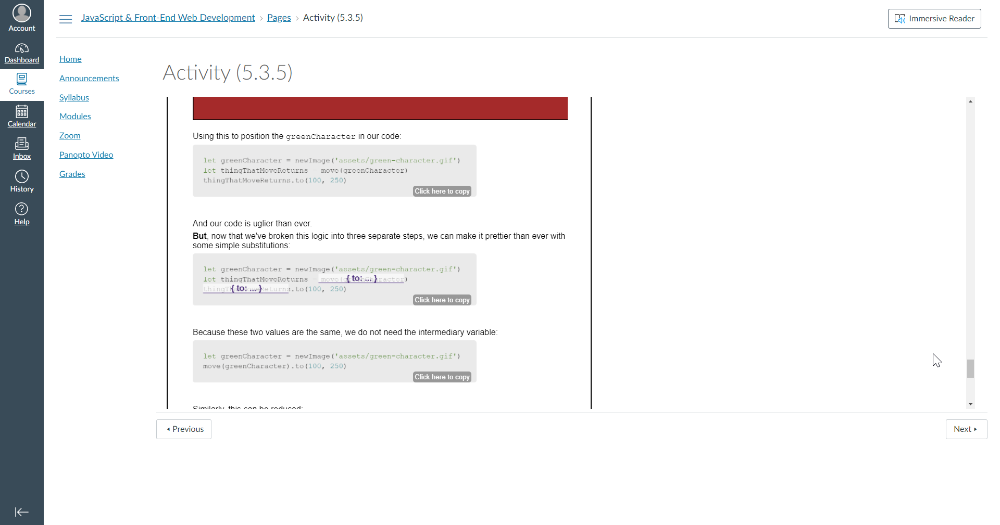


</details>