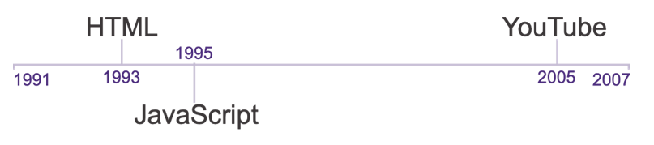

# Front-End Development in Context

## Questions

1. What is the difference between front-end and back-end programming?

2. Why is JavaScript important to front-end programming?

3. What is the difference between previous websites we've built (HTML/CSS) and most modern sites? A: **Interactivity**.

4. What is a browser?

5. What is a server?

## Lecture Outline

#### Differences Between Front-End and Back-End Programming

> "The lag associated with server-side-rendering web applications helps to highlight the underlying distinction between code that is running remotely and code that is running locally in a user's browser."
> 
> [W]e can use back-end programming for more than just interactivity and [...] there are many things that only back-end programming can accomplish to avoid giving a mistaken impression that front-end programming is universally better.
> 
> [B]rowsers make HTTP requests to servers; and browsers parse HTML and CSS to display webpages.
> 
> Servers listen for HTTP requests from browsers.
> 
> Servers respond to HTTP requests with HTML and CSS.
> 
> Before JavaScript, having servers respond with dynamically generated HTML and CSS was the only way to make a website interactive.
> 
> HTML and CSS are static, while JavaScript can react, specifically it can react to
> users interacting with our web app.

The point:  It took a long time to develop modern internet services even though JavaScript was introduced in 1995.

## Course Objectives

1. Review JavaScript basics

2. Organize and Re-Use Code with Functions

3. Organize and Re-Use Code with Classes

4. Asynchronous Programming

5. Manipulating the DOM

6. Third-Party JavaScript Tools

## Lesson Companion

## For Further Research

1. WebAssembly

