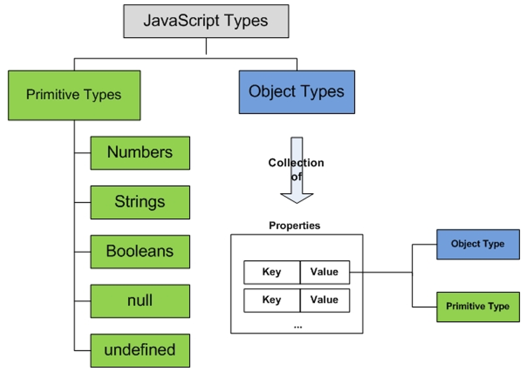
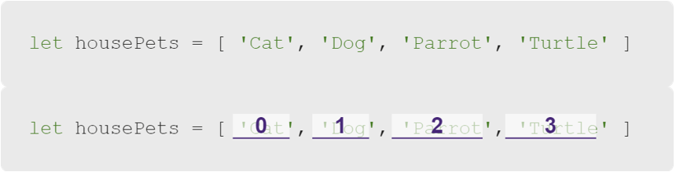
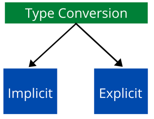
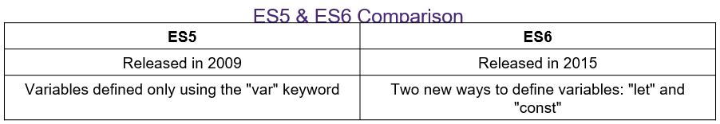
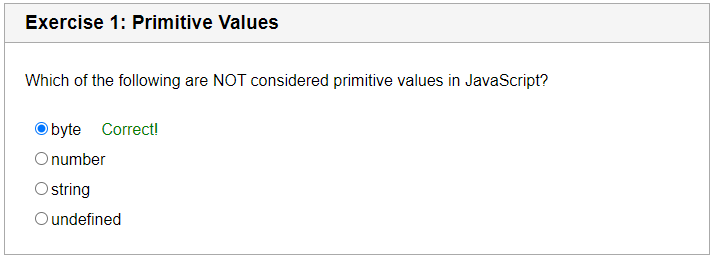
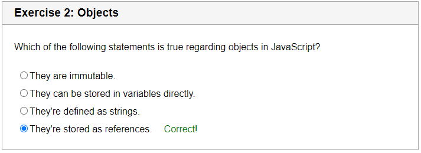
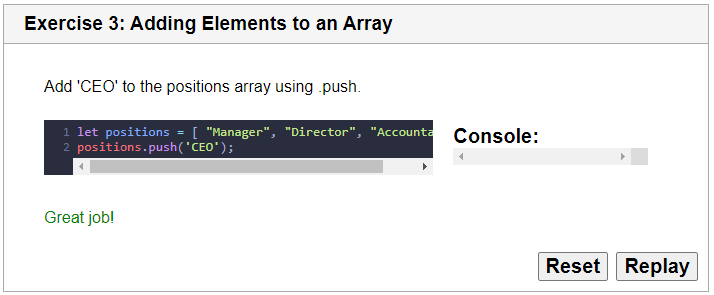
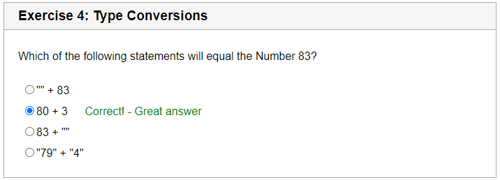
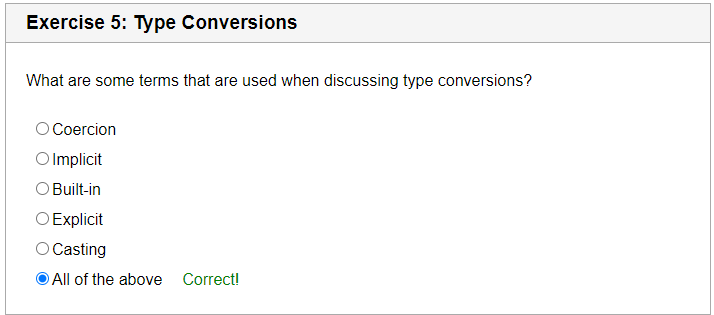
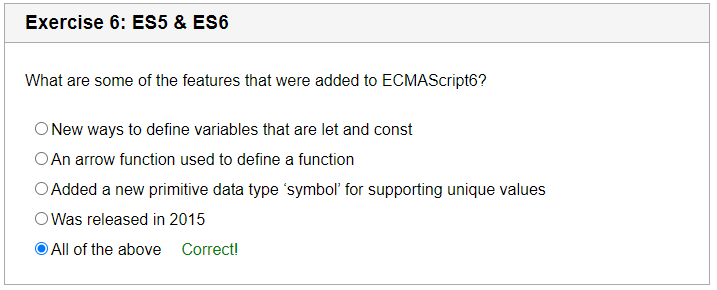

# Primitive Types and Objects

## Questions

1. What is the difference between a primitive and object type?

2. How do you use arrays to store data?

3. How do you perform an explicit type conversion?

4. What are the major differences between ES5 and ES6?

5. What is an object type constructor?

6. How do you know the <u>scope </u>of a variable?

7. How do you know if a variable is <u>reassignable</u>?

8. How do you know if a variable is <u>redeclarable</u>?

9. What does it mean for a variable to be <u>immutable</u>?

## Lecture

### Data Types



> Data types that are known as primitive values in JavaScript are numbers, strings, booleans, null, and undefined. Objects such as functions and arrays are referred to as non-primitive values.

### Arrays

```js
let housePets = ['Cat', 'Dog', 'Parrot', 'Turtle'];
```



```js
console.log(housePets[0]); // Prints "Cat"
console.log(housePets[1]); // Prints "Dog"
console.log(`I love my ${housePets[1]}.`); // Prints "I love my Dog."
console.log(housePets); // Returns (not prints) ['Cat', 'Dog', 'Parrot', 'Turtle']
```

```js
housePets.push('Ferret');
console.log(housePets); // ['Cat', 'Dog', 'Parrot', 'Turtle', 'Ferret']
```

1. Arrays are created using square brackets.

2. Arrays are indexed (positioned) starting at zero.

3. Arrays can be accessed by the array variable name, brackets, and the index.

4. The `.push()` method appends to the end of the element.  The index it goes into is found using `housePets.length` *before* the `.push()` method is used.

### Type Conversions



> Type conversion is converting one type of data to another type. A function or operator expects its parameters to have certain types. If a value is not the right type for a parameter, it must be converted. Coercion is implicit, cast is explicit, and conversion is any of them.

```js
console.log(typeof 72); // number
console.log(typeof 'instructor'); // string
console.log(typeof false); // boolean
console.log(typeof undeclaredVariable); // undefined


let a = null;
console.log(typeof a); // object

let b
console.log(typeof b); // undefined
```

Implicit type conversions (coersions) are performed by the interpretter automatically.  Programmer must guard against writing invalid code that violates what consuming functions and operators want.  Otherwise - errors, or worse - unintended consequences.

```js
11 + ""; // string
"15" + 15; // string
"10" + "5"; // string
"10" - "5"; // number
```

Explicit conversion are performed by <u>object type constructors</u> such as `String()`, `Number()` and `Boolean()`.  JavaScript has objects that are wrappers for primitives, and using these object type constructors allows the object methods (`String()`, `Number()`, and `Boolean()`) to perform explicit conversions, whereas the primitive data types themselves do not have methods to perform this themselves.

### European Computer Manufacturers Association (ECMA)

> ECMA defines standards upon which other scripting languages are built. This affects JavaScript! The committee consisted of developers from Sun Microsystems, Netscape Communications, Microsoft, and various other companies. Invented by <u>Brendan Eich</u> at Netscape, ECMAScript made its first appearance in the <u>Navigator 2.0 browse</u>r.



> ES5 is a shortening of ECMAScript5 and is also known as ECMAScript2009.
> 
> The sixth version of the ECMAScript standard is ES6 or ECMAScript6. It is also called ECMAScript2015.
> 
> ES6 is a significant upgrade in the JavaScript language that permits the development of complex applications.

### Declaring a Variable

```js
var a
let b
const C
```

It is important to know the <u>scope </u>of a variable.

It is also important to know if a variable is <u>reassignable</u>.

And, it is important to know if a variable is <u>redeclarable</u>.

## Lesson Companion







```js
let positions = [ "Manager", "Director", "Accountant" ]
positions.push('CEO');
```







## Activity

Code review

#TODO


