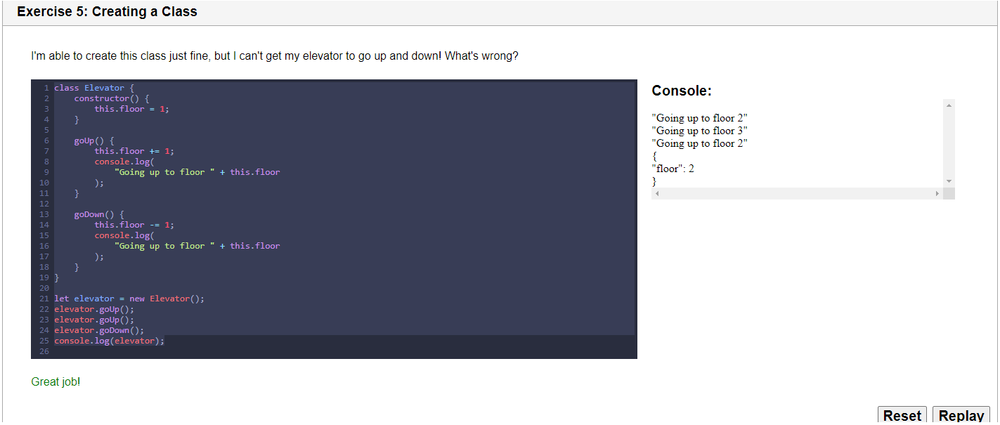

# Classes, Properties and Methods

<blockquote>
Classes in JavaScript appear to just be functions with no parameters, utilized in a prescribed way to mimic real-life objects.

<cite>- Scott Green</cite>
</blockquote>

<details>
<summary>Slides</summary>


```javascript
class Car {
  constructor(make, model, color) {
    this.make = make;
    this.model = model;
    this.color = color;
  }
}

let newJaguar = new Car('Jaguar', 'Turbo XE', 'Black');
console.log(newJaguar);
```


```javascript
class Car {
  constructor(make, model, color) {
    this.make = make;
    this.model = model;
    this.color = color;
  }
  drive() {
    console.log('Drive');
  }
}

let newJaguar = new Car('Jaguar', 'Turbo XE', 'Black');
newJaguar.drive();
```


```javascript
class Car {
  constructor(make, model, color) {
    this.make = make;
    this.model = model;
    this.color = color;
  }
  drive() {
    console.log('Drive');
  }
  carInfo() {
    console.log(`Make: ${this.make}, Model: ${this.model}, Color: ${this.color}.`)
  }
}

let newJaguar = new Car('Jaguar', 'Turbo XE', 'Black');
newJaguar.drive();
newJaguar.carInfo();
```


</details>

<details>
<summary>Lesson Companion</summary>


```javascript
class Fruit {
    constructor(name, color) {
        this.name = name;
        this.color = color;
    }
}

let banana = new Fruit('banana', 'yellow');
console.log(banana);
```


```javascript
class Elevator {
    constructor() {
        this.floor = 1;
    }
    
    goUp() {
        this.floor += 1;
        console.log(
            "Going up to floor " + this.floor
        );
    }

    goDown() {
        this.floor -= 1;
        console.log(
            "Going up to floor " + this.floor
        );
    }
}

let elevator = new Elevator();
elevator.goUp();
elevator.goUp();
elevator.goDown();
console.log(elevator);
```



It's missing the constructor...
```javascript
class TV{
  constructor(size, brand){
    this.size = size;
    this.brand = brand;
  }
}

let myTV = new TV("big", "Sony");
console.log(myTV);
```


</details>

<details><summary>Activity - Classes of Chance</summary>

<deails>
<summary>Instructions</summary>


</details>

## Initial Code

```javascript
class Casino {
    // Write code here
};

// TESTS
const myCasino = new Casino("HackerU Casino");
console.log(myCasino);
myCasino.playGame(5);
myCasino.playGame(15);
myCasino.playGame(25);
myCasino.playGame(35);

// BONUS TESTS
/*
const myBonusCasino = new Casino("HackerU Bonus Casino", true);
console.log(myBonusCasino);
myBonusCasino.playGame(5);
myBonusCasino.playGame(15);
myBonusCasino.playGame(25);
myBonusCasino.playGame(35);
*/

// Extra BONUS TESTS
/*
const myExtraBonusCasino = new Casino("HackerU Extra Bonus Casino", false);
console.log(myExtraBonusCasino);
myExtraBonusCasino.rollDie(6);
myExtraBonusCasino.rollDie(20);
myExtraBonusCasino.rollDie(100);
*/
```


From the instructions - Class Methods Can Take Input and Return Values

```javascript
class Calculator {
  addNums(num1, num2) {
    return (num1 + num2);
  }
}

const calc = new Calculator();
console.log(calc.addNums(7, 33));
```

## Final Solution Code

```javascript
class Casino {
    constructor (name, isFakeCoin) {
      this.name = name;
      this.isFakeCoin = isFakeCoin;
      this.timesPlayed = 0;
    }
    playGame(betAmount) {
      if(Math.random() <= 0.5 || this.isFakeCoin) {
        this.timesPlayed = 0;
        console.log(`${this.name} wins!`);
      } else {
        this.timesPlayed++;
        console.log(`You won ${betAmount * (this.timesPlayed)} dollars at the ${this.name}!`);
        betAmount = betAmount * (this.timesPlayed);
      }
    }
    rollDie(d) {
      console.log(`You rolled a ${Math.floor(Math.random() * d) + 1}!`)
    }
};

// TESTS
const myCasino = new Casino("HackerU Casino");
console.log(myCasino);
myCasino.playGame(5);
myCasino.playGame(15);
myCasino.playGame(25);
myCasino.playGame(35);

// BONUS TESTS
const myBonusCasino = new Casino("HackerU Bonus Casino", true);
console.log(myBonusCasino);
myBonusCasino.playGame(5);
myBonusCasino.playGame(15);
myBonusCasino.playGame(25);
myBonusCasino.playGame(35);


// Extra BONUS TESTS
const myExtraBonusCasino = new Casino("HackerU Extra Bonus Casino", false);
console.log(myExtraBonusCasino);
myExtraBonusCasino.rollDie(6);
myExtraBonusCasino.rollDie(20);
myExtraBonusCasino.rollDie(100);
```

<blockquote>
The solution code to the Extra Bonus section is incorrect.

<cite>- Scott Green</cite>
</blockquote>

</details>