# Class Inheritance

## Slides

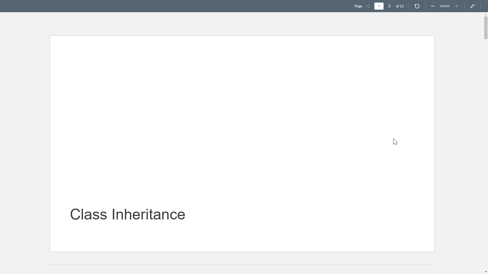

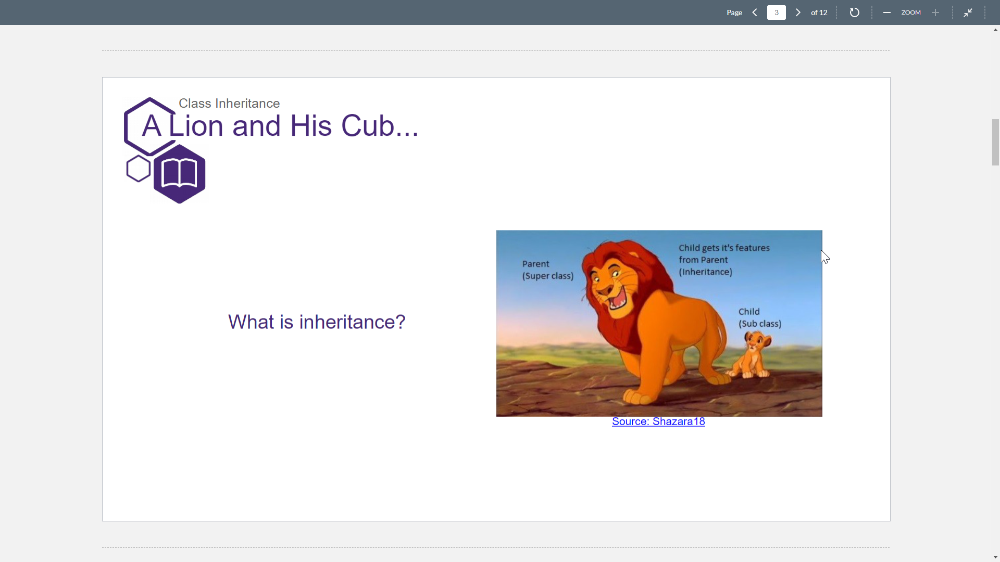
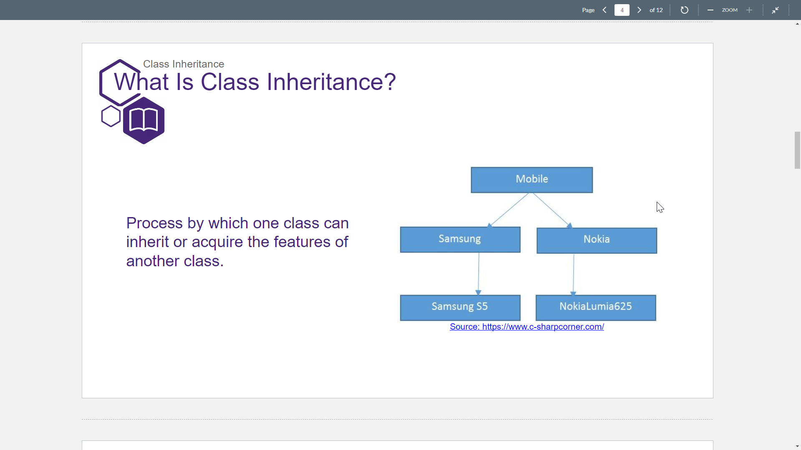
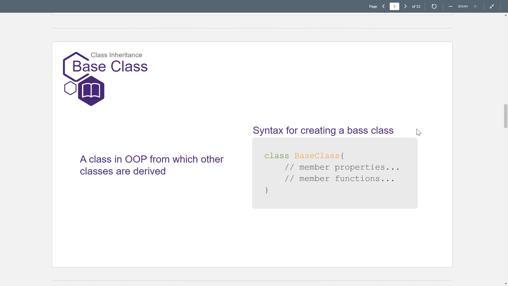
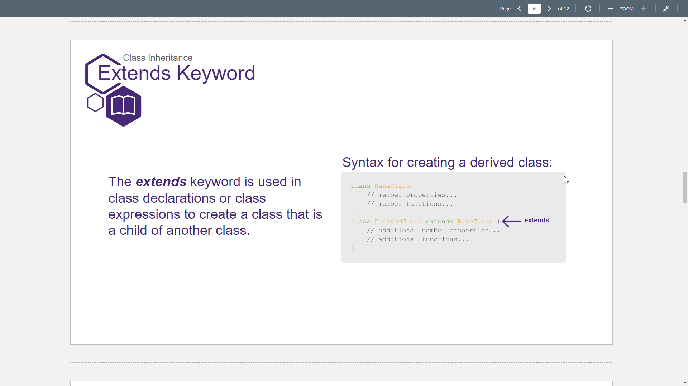
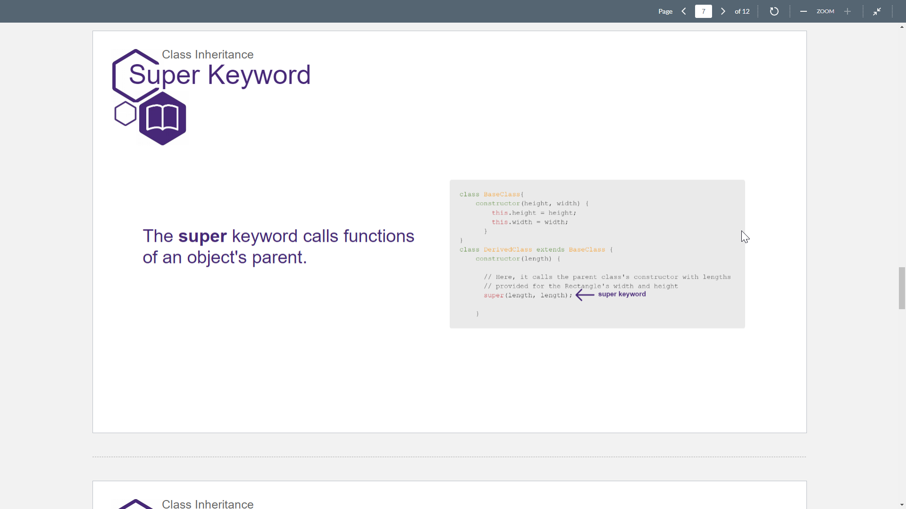
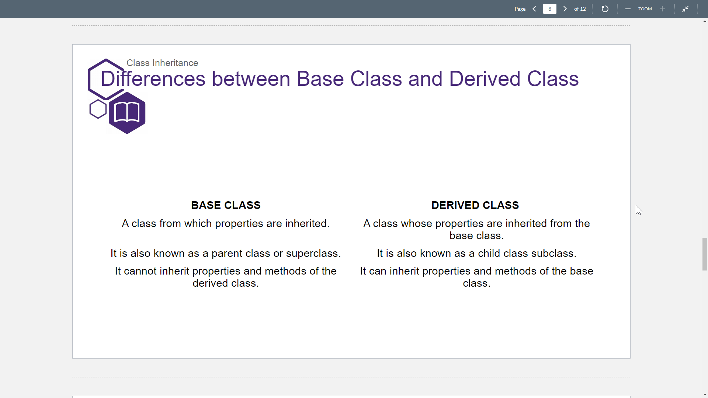
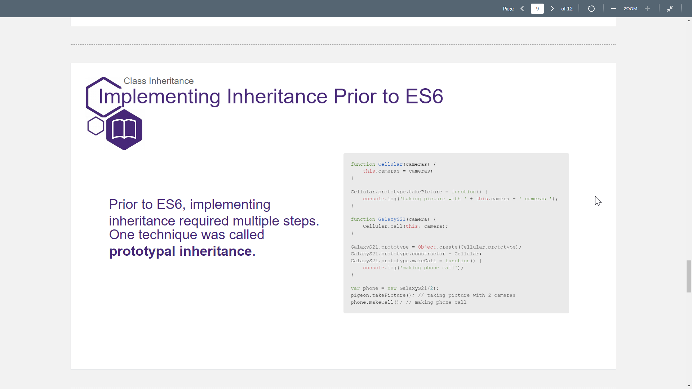
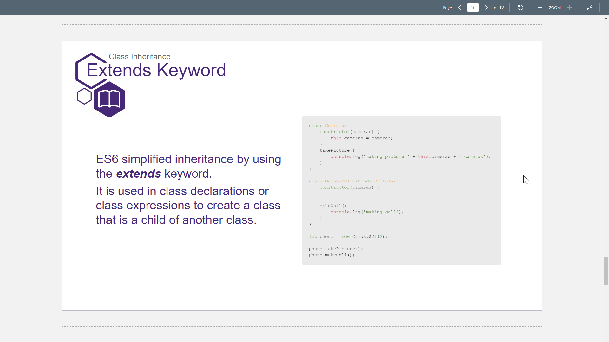
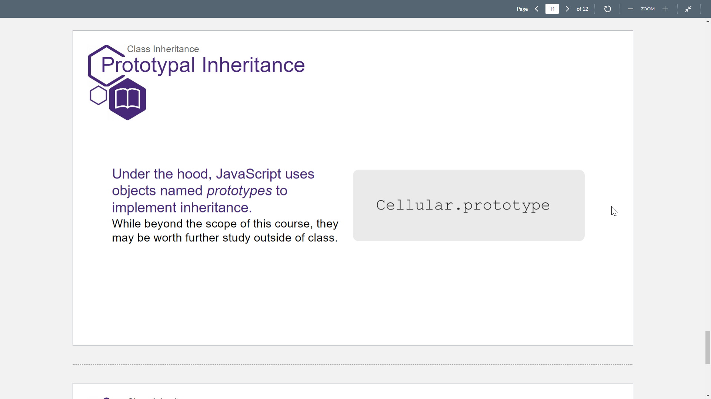
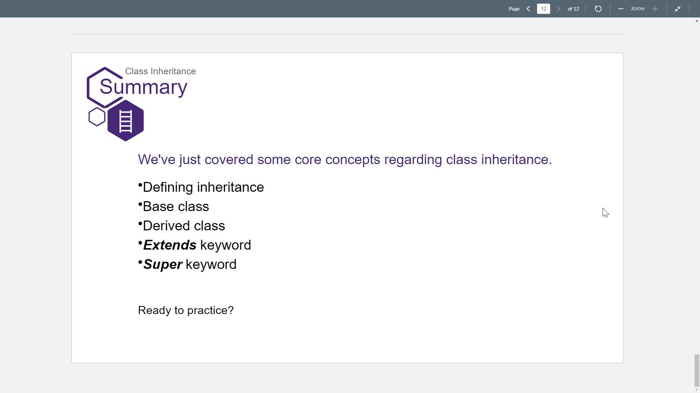

## Lession Companion

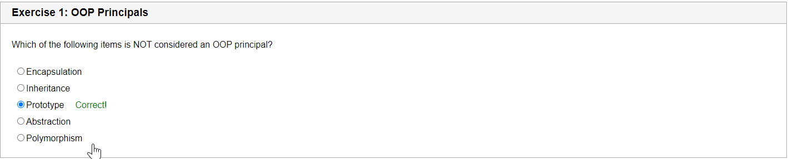
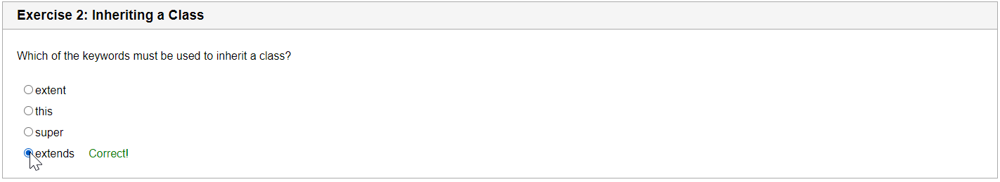
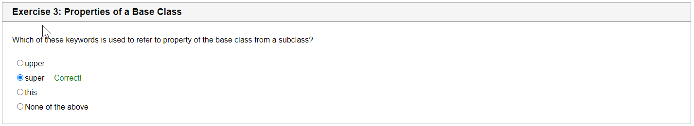
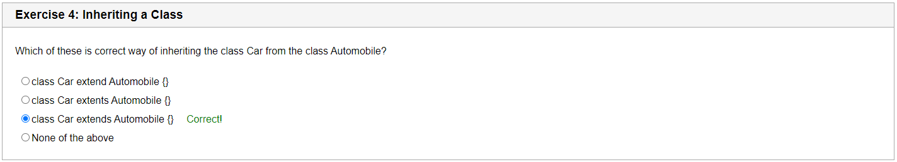
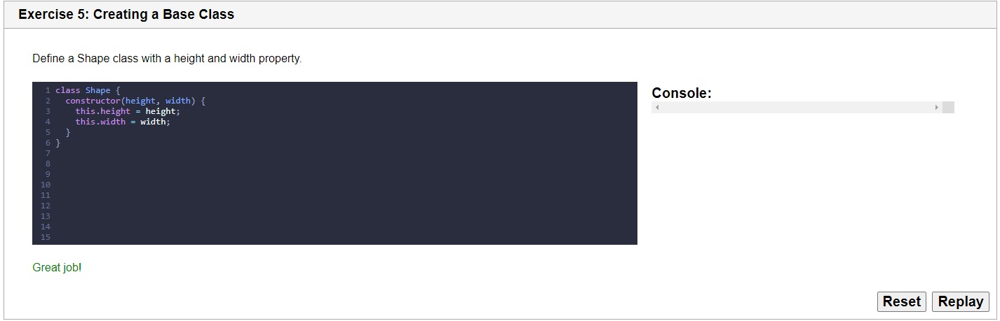
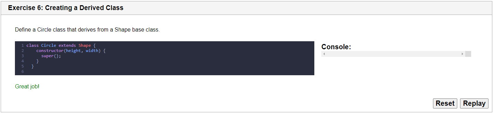

Note that the `super()` method must be called within the child class's constructor.  Very important!

## Activity - Diamond Knight Scanning


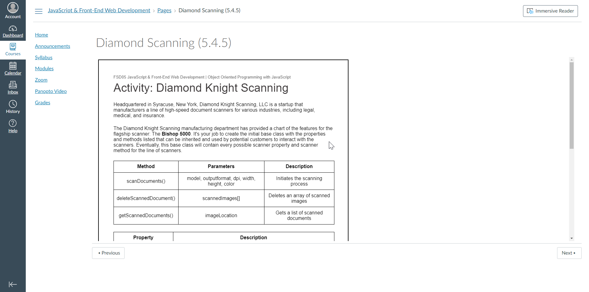

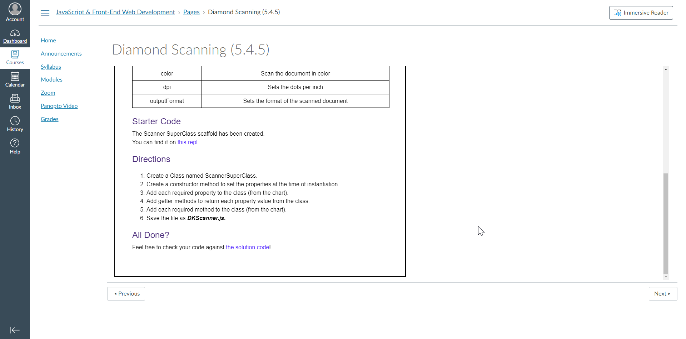

### Submitted Code

```javascript
class ScannerSuperClass {
  constructor(model, height, width, color, dpi, outputFormat) {
    this.model = model;
    this.height = height;
    this.width = width;
    this.color = color;
    this.dpi = dpi;
    this.outputFormat = outputFormat;
  }
  get color() {
    return this.color;
  }
  get dpi() {
    return this.dpi;
  }
  get outputFormat() {
    return this.outputFormat;
  }
  scanDocuments(model, outputformat, dpi, width, height, color) {
    console.log('scanDocuments');
    return {model, outputformat, dpi, width, height, color}
  }
  deleteScannedDocument(scannedImages) {
    console.log('deleteScannedDocuments');
    return {scannedImages}
  }
  getScannedDocuments(imageLocation) {
    console.log('getScannedDocuments');
    return {imageLocation}
  }
}
```

### Solution Code

```javascript
class ScannerSuperClass {

  // create class constructor
  constructor(model, height, width, color, dpi, outputFormat) {
    this.model = model;
    this.height = height;
    this.width = width;
    this.color = color;
    this.dpi = dpi;
    this.outputFormat = outputFormat;
  }

  // getter method to get the scanner model property value
  get model() {
    return this.model;
  }

  // getter method to get the height property for the scanned document
  get height() {
    return this.height;
  }

  // getter method to get the width property for the scanned document
  get width() {
    return this.width;
  }

  // getter method to get the scan greyScale property value
  get greyScale() {
    return this.greyScale;
  }

  // getter method to get the scan color property value
  get color() {
    return this.color;
  }

  // getter method to get dpi property value
  get dpi() {
    return this.dpi;
  }

  // method to inititate the scan
  scanDocument(model, outputFormat, dpi, width, height, color, greyScale) {

    //scanning logic will be implemented here  
    console.log("Scanning document ")

    return { model, outputFormat, dpi, width, height, color }
  }

  // method to retrieve scanned documents
  getScannedDocuments(imageLocation) {

    //logic will be implemented here
    console.log("Getting scanned images")

    return { imageLocation }
  }

  // method to delete scanned documents
  deleteScannedDocuments(scannedImages) {
    //logic will be implemented here
    console.log("Deleting scanned images")

    return {scannedImages}
  }
}
```
